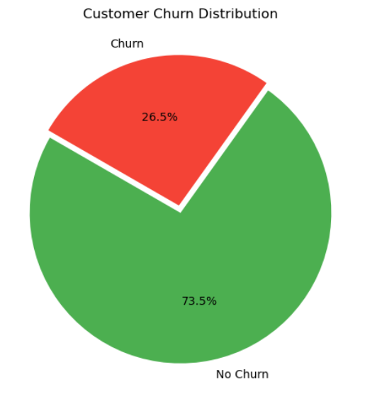

# 📊 Customer Churn Analysis & Prediction: Insights-Driven Retention Strategies

## 📌 Project Overview
This project analyzes a **Telco Customer dataset** to uncover drivers of **customer churn**  and builds a **Logistic Regression model** to predict churn.  

The project combines **Exploratory Data Analysis (EDA)**, **feature engineering**, **machine learning modeling**, and **business insights** to help businesses design data-driven retention strategies.  

---

## 🗂️ Dataset
- **Source:** Telco Customer Churn dataset (7,043 customers)
- **Target variable:** `Churn` (Yes/No)
- **Key features:** Demographics, contract type, payment method, services subscribed, tenure, charges.

---

## ⚙️ Steps in the Project
1. 📥 **Data Loading & Cleaning**  
   - Removed irrelevant identifiers (e.g., `customerID`).  
   - Handled missing values (`TotalCharges`).  

2. 🔍 **Exploratory Data Analysis (EDA)**  
   - Univariate and bivariate analysis.  
   - Correlation heatmap and churn distribution.  

3. 📊 **Visualizations**  
   - Churn distribution pie chart.  
   - Contract type vs churn.  
   - Tenure groups vs churn.  
   - MonthlyCharges distribution.  
   - Payment methods & services usage patterns.  

4. 🔧 **Feature Engineering**  
   - `AvgChargesPerMonth`.  
   - `MultipleServices` (count of services).  
   - Tenure group categorization.  

5. 📏 **Feature Scaling & Encoding**  
   - Standardized numerical features.  
   - Label encoding for categorical variables.  
   - Target encoding: `Churn` → Yes=1, No=0.  

6. 🧪 **Data Split**  
   - Train-Test split for model evaluation.  

7 🤖 **Model Training**

After data preprocessing and feature engineering, two ensemble models were trained for churn prediction:

1. **Random Forest Classifier**  
2. **XGBoost Classifier**

Both models were fine-tuned using **hyperparameter optimization** with **Stratified K-Fold Cross Validation** and **Grid/Random Search**, ensuring balanced performance and robust generalization.

---

## 📈 **Model Performance Comparison**

| Model          | Accuracy | Recall  | F1 Score | ROC-AUC |
|----------------|-----------|----------|-----------|----------|
| Random Forest  | 0.7913    | 0.6595   | 0.6260    | 0.8468   |
| **XGBoost**    | 0.7779    | **0.7158** | **0.6305** | **0.8480** |

### ✅ Final Model: **XGBoost Classifier**

Although Random Forest achieved slightly higher **accuracy**, the **XGBoost model** outperformed it in **recall**, **F1 score**, and **ROC-AUC**, offering a better balance between precision and sensitivity — crucial in churn prediction tasks.

---

8 🎯 **Why Recall Matters in Churn Prediction**

In churn analysis, **recall** is the most important metric because:
- It measures how well the model identifies **true churners** (customers likely to leave).  
- Missing churners (false negatives) leads to **lost customers and revenue**.  
- A higher recall ensures the business can proactively **target at-risk customers** for retention.  

Hence, **XGBoost** is selected as the final production model for churn prediction and customer retention strategy development.

9. 💡 **Insights & Recommendations**  
   - Identified churn drivers (contract type, tenure, pricing, security services).  
   - Provided actionable strategies for retention.  

---

## 🔑 Key Insights
- **Contract type:** Month-to-month customers churn **42.7%**, vs **2.8%** for 2-year contracts.  
- **Tenure:** Most churn happens in the **first 12 months**.  
- **Pricing:** Higher `MonthlyCharges` strongly correlate with churn.  
- **Services:** Customers with **OnlineSecurity/TechSupport** churn much less.  
- **Payment method:** **Electronic check users** churn the most (**45.3%**).  
- **Demographics:** Senior citizens and customers without partners/dependents churn more.  

---

## 🧭 Recommendations
1. Convert **month-to-month customers** into long-term contracts via loyalty offers.  
2. Provide **early onboarding programs** during first 6–12 months.  
3. Reduce **price shock** for high-bill customers with bundles.  
4. Cross-sell **security & support services**.  
5. Encourage **auto-pay methods** to reduce churn.  
6. Use churn prediction model for **proactive retention outreach**.  

---

## 📸 Sample Visualizations
  
  
  

---

## 🛠️ Tech Stack
- **Python**: pandas, numpy, matplotlib, seaborn, scikit-learn  
- **Jupyter Notebook** for analysis & modeling  
- **Visualization Tools:** matplotlib, seaborn  

---

## 🙌 Acknowledgements
Dataset reference: Telco Customer Churn Dataset (Kaggle / IBM Sample Dataset).  
Special thanks to the open-source Python community for libraries that make data analysis powerful and accessible.  
